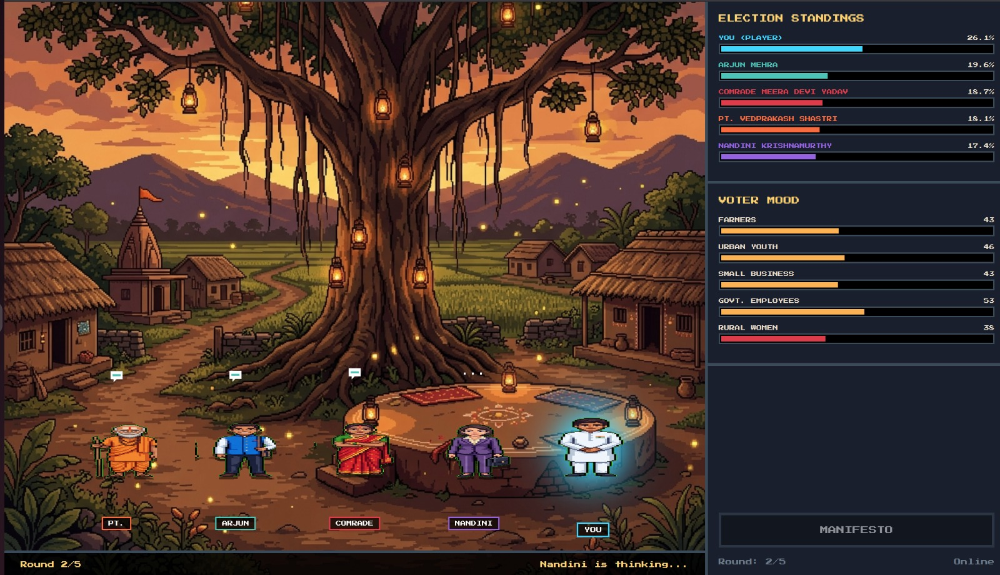

# Panchayat AI: Generative Political Simulation Engine

Panchayat AI is a highly interactive, 16-bit retro RPG-style political simulation framework powered by Generative AI. It allows users to simulate local Indian electoral dynamics (Panchayat) by participating in a turn-based manifesto selection process against a diverse cast of AI-driven opposing candidates.


*A real-time 70-30 split-screen layout featuring dynamic pixel sprites, Server-Sent Events (SSE) streaming, and real-time AI dialogue.*

---

## Core Features

1. **Retro 16-Bit Interface Architecture**
   - Custom pixel-art character sprites and environmental backgrounds.
   - Authentic retro typography utilizing `Press Start 2P` and `VT323` fonts.
   - Dynamic CSS animations including idle states, active thinking states, and action-oriented visual highlighting.

2. **Real-Time Generative AI Opponents**
   - Driven by the Gemini 4 model via LangGraph orchestration.
   - Opponents autonomously select policies and generate contextual reactions based on rigid ideological constraints and predefined personas (e.g., Traditionalist, Techno-Populist).

3. **Mathematical Ideology Engine**
   - Uses a custom scoring engine (`ideology_engine.py`) to calculate voter alignment via cosine similarity across 8 distinct ideological axes (Economy, Environment, Welfare, etc.).
   - Granular demographic modeling enables population subsets (Farmers, Urban Youth, Business Owners) to react independently to identical policies based on their unique priority weights.

4. **Asynchronous State Streaming**
   - Utilizes Server-Sent Events (SSE) for progressive, real-time game state updates.
   - Each simulation round generates a stream of incremental actions, sequentially resolving AI decision-making, dialogue generation, and mathematical sentiment shifts upon the voting population.

5. **Iterative Simulation Loop**
   - The engine runs a standard 5-round competitive loop.
   - Live dashboard metrics provide immediate feedback regarding demographic approval ratings.
   - The simulation concludes with an aggregate vote share computation and winner declaration.

---

## Technical Stack

- **Backend AI Engine**: Python 3, FastAPI, LangGraph, LangChain, Google Gemini API.
- **Frontend Client**: React (Vite), TypeScript, Custom CSS design system.
- **Data Synchronization**: Server-Sent Events (SSE) for unidirectional real-time data streaming.

---

## Installation & Setup

### Prerequisites
- Python 3.10 or higher
- Node.js 18 or higher
- Google Gemini API Key

### 1. Backend Initialization (FastAPI)

Navigate to the project root directory and execute the following commands to initialize the backend environment:

```bash
cd Panchayat

# Initialize and activate the Python virtual environment
python3 -m venv .venv
source .venv/bin/activate

# Install required dependencies
pip install -r requirements.txt

# Configure environment variables
echo "GOOGLE_API_KEY=your_gemini_api_key_here" > .env

# Start the FastAPI application server
uvicorn bridge.api_server:app --port 8000 --host 0.0.0.0 --reload
```

### 2. Frontend Initialization (React/Vite)

Open a separate terminal window and navigate to the client directory:

```bash
cd Panchayat/client

# Install Node dependencies
npm install

# Start the Vite development server
npm run dev
```

---

## Application Workflow

1. **Initiate the Simulation**: Access the web client and select the "MANIFESTO" action to begin the round.
2. **Policy Selection**: Choose a desired policy directive to announce to the voting population.
3. **Execution & Observation**:
   - The backend processes the SSE stream, triggering the AI agents to formulate contextual responses.
   - Opposing AI candidates autonomously query the ideology engine to select optimal counter-policies.
   - The state of the voter demographic metrics dynamically updates in response to the aggregate ideological shifts.
4. **Conclusion**: After the execution of 5 rounds, the candidate with the highest cumulative voter alignment is declared the winner via the final election forecast generation.

---

## Project Structure

```text
Panchayat/
│
├── bridge/                 # LLM Orchestration and API layer
│   ├── api_server.py       # FastAPI application and SSE endpoints
│   ├── langgraph_engine.py # Agent definitions and turn resolution
│   └── ai_prompts.py       # Persona constraints and system instructions
│
├── data/                   # Simulation Logic and Knowledge Base
│   ├── ideology_engine.py  # Mathematical alignment algorithms
│   ├── manifestos.json     # Policy definitions database
│   ├── candidates.json     # Character metadata
│   └── voter_profiles.py   # Demographic weighting arrays
│
├── client/                 # React Frontend Client
│   ├── index.html          # Application entry point
│   ├── src/
│   │   ├── api/            # API communication interfaces
│   │   ├── components/     # Modular React components
│   │   ├── data/           # Client-side static definitions
│   │   ├── App.tsx         # Primary application layout
│   │   └── index.css       # Core styling system
│   └── public/assets/      # Static media resources
```
